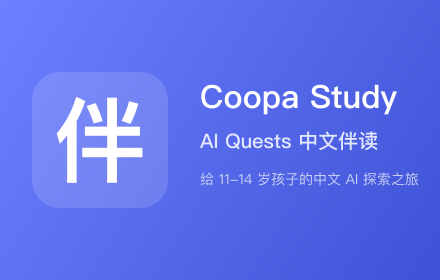

# Coopa Study

> **让 Google AI Quests 说中文。**

Chrome / Edge 浏览器插件，把 [Google AI Quests](https://research.google/ai-quests) 的界面、对话、过场字幕全部变成中文，并在右侧提供术语卡与伴读讲解。面向 11–14 岁中国孩子。



## 它做什么

装上插件，访问 AI Quests：

- 主页「Accept mission」→「接受任务」；地图页「Start Quest」→「开始任务」
- Skye 教授开场独白、Luna 的市场开场视频的字幕全是中文
- 任务提示、选项按钮、物品栏标签全是中文
- 右侧有一个紫色「伴」字细条，点开是中文伴读面板：AI 术语卡、玩法提示、概念讲解

## 它不做什么

- **不收集任何用户数据**（没 analytics、没 tracker、没 SDK）
- 不修改 AI Quests 游戏主体，卸载即恢复英文原版
- 不调用任何远程 API / LLM

详见 [隐私政策](docs/release/PRIVACY_POLICY.md)。

## 安装

### 用户（从 Chrome Web Store）

_待上架。_

### 开发者（本地加载 unpacked）

```bash
git clone https://github.com/notwin/coopa-study.git
cd coopa-study
npm install
npm run build
```

Chrome → `chrome://extensions` → 开发者模式 ON → **加载已解压的扩展程序** → 选 `dist/`。

访问 `https://research.google/ai-quests/intl/en_gb` 即可看到汉化生效。

## 开发

```bash
npm test              # 单元测试（22）
npm run test:e2e      # Playwright E2E
npm run verify:shape  # 校验中文 JSON 和英文源字段对齐
npm run lint:types    # TypeScript 严格检查
```

### 更新 CMS 英文源

Google 可能更新游戏内容；拉最新、找差异、补译、重打包：

```bash
node scripts/fetch-cms.mjs       # 拉最新英文源到 content-source/
npm run verify:shape             # 定位 content-zh 里缺的新字段
# 手工补译 public/content-zh/en_gb/*.json 里的新字段
npm run build                    # 重新生成 rules.json + dist/
```

### 打包分发

```bash
npm run package  # 产出根目录 coopa-study-0.1.0.zip
```

## MVP 验收清单

装 `dist/` 到 Chrome 后，访问 `https://research.google/ai-quests/intl/en_gb`，逐项核对：

- [ ] 首页「Accept mission」变成「接受任务」
- [ ] 地图页的「Start Quest」变成「开始任务」
- [ ] 点开 Flood Forecasting，开场 cinematic 第一句字幕是「糟糕……我们麻烦大了。」
- [ ] Skye 开场独白首句是「欢迎来到 AI 探索之旅」
- [ ] 右侧细条可见，点开展开伴读面板，能切章节、翻术语卡
- [ ] 关闭浏览器再打开，折叠偏好保留

## 项目结构

```
coopa-study/
├── src/
│   ├── content/             # content script：挂载 Shadow DOM 伴读面板
│   ├── sidebar/             # Preact 伴读 UI（App + blocks + storage）
│   ├── companion-packs/     # 伴读面板的中文术语卡/讲解
│   └── schema/              # zod 类型
├── public/
│   ├── content-zh/          # 中文 CMS JSON（DNR 规则重定向目标）
│   └── icons/               # 图标 + 宣传图
├── content-source/          # Google CMS 英文源（对齐结构用）
├── scripts/
│   ├── fetch-cms.mjs        # 拉最新英文源
│   ├── verify-shape.mjs     # 字段对齐校验
│   ├── build-rules.mjs      # 自动生成 MV3 DNR 规则
│   └── build-icons.mjs      # SVG → PNG
├── tests/                   # unit + E2E
└── docs/
    ├── superpowers/         # 设计文档 + 实施计划
    └── release/             # 发布文案（商店 / 权限 / 隐私）
```

## 发布清单（Chrome Web Store）

`docs/release/` 下有完整素材与文案：

- [`STORE_LISTING.md`](docs/release/STORE_LISTING.md) — 名称、描述、关键字、类别
- [`PERMISSIONS.md`](docs/release/PERMISSIONS.md) — 每个权限的使用理由
- [`PRIVACY_POLICY.md`](docs/release/PRIVACY_POLICY.md) — 隐私政策（中英双语）
- `public/icons/icon128.png` — 商店主图标 128×128
- `public/icons/promo-tile-440x280.png` — 宣传小图（必需）
- `public/icons/marquee-1400x560.png` — 宣传大图（推荐）
- `docs/release/screenshots/*.png` — 商店截图

## License

[MIT](LICENSE) · 游戏内容归 Google LLC 所有。本插件是非官方社区汉化，与 Google 无关联。

---

Made with ❤ for kids learning AI in Chinese.
